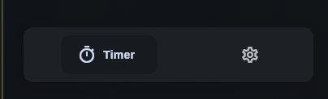

New Navigation bar is redesign
<!--truncate-->

## Navbar Redesign

A new redesign has been applied to the app’s navigation bar to improve both usability and visual consistency.

This update introduces a cleaner layout and smoother interactions by leveraging a dedicated Flutter package.

## Package & Effect

The navigation bar is now implemented using the **Google Nav Bar** Flutter package:

👉 https://pub.dev/packages/google_nav_bar

This package provides customizable animations, modern styling, and better feedback for user interactions.

Below is a preview of the updated navigation bar:

