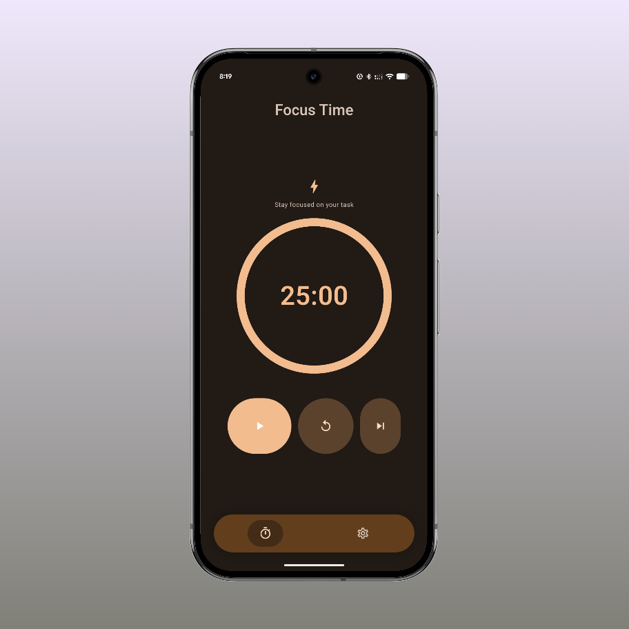
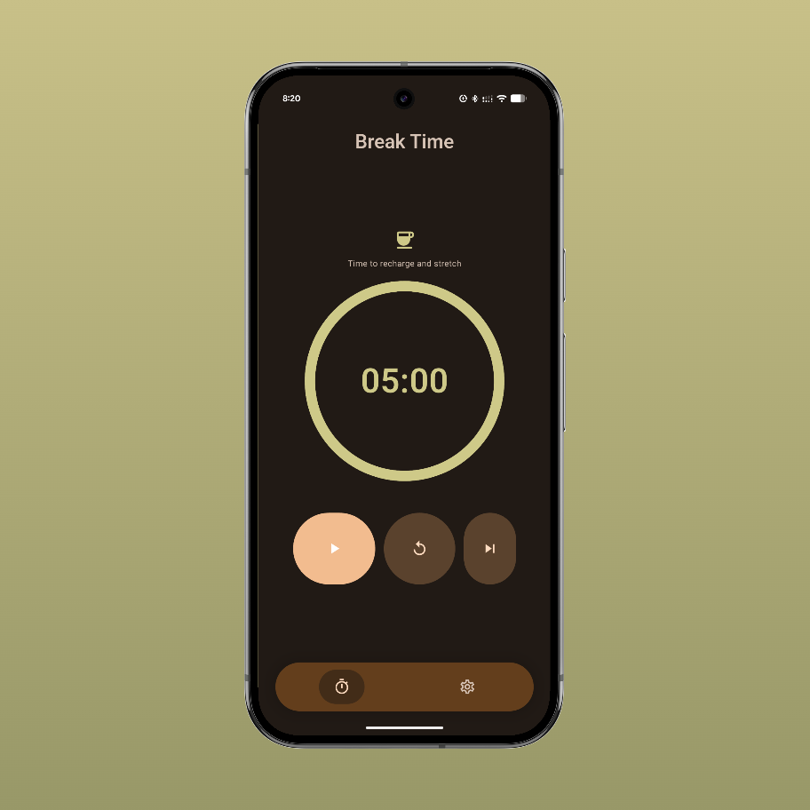
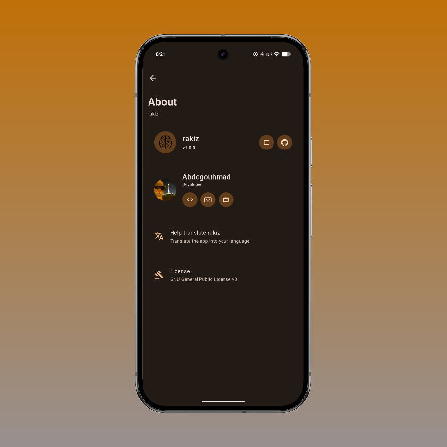
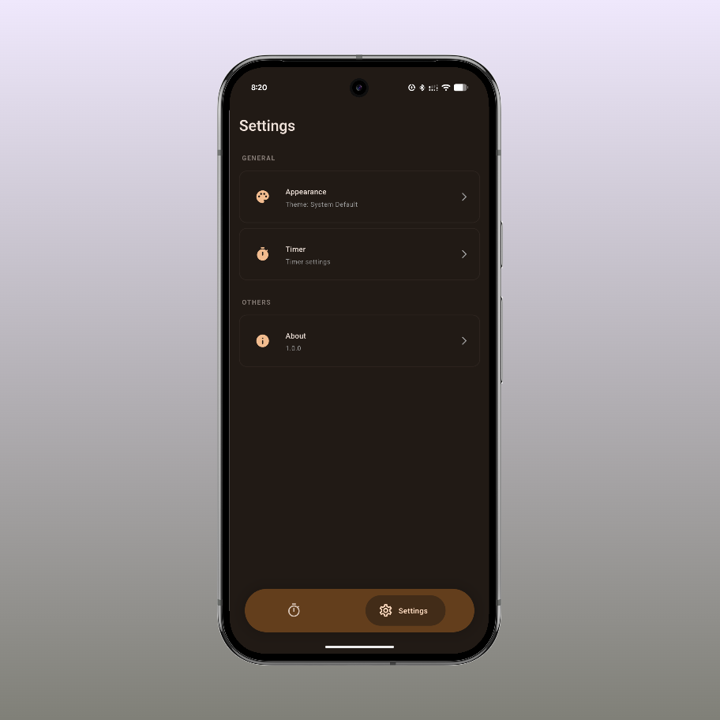

After months of refining the experience, we're excited to announce **Rakiz v1.0.0** — the first stable release of our minimal Flutter timer app.

<!--truncate-->

## What is Rakiz?

Rakiz is a clean, smooth, and distraction-free timer app built with Flutter. The goal has always been simple: deliver the best possible experience by pushing Flutter's performance, animations, and UI capabilities to their fullest.

## What's in v1.0.0?

This release marks the foundation of everything Rakiz stands for:

- **Material 3 (Expressive) UI** — a minimal, modern interface that feels at home on any Android device
- **Dynamic colors** — the app adapts to your wallpaper for a truly personal experience
- **Focus & Break modes** — smooth transitions between work and rest sessions
- **Fully customizable timer** — set your own durations, reset anytime, and get notified when time is up
- **Minimal statistics** — just enough to keep you on track, nothing to pull you away from what matters

## Screenshots

| Home (Focus) | Home (Break) |
|:---:|:---:|
|  |  |

| About | Settings |
|:---:|:---:|
|  |  |

## Get Rakiz

Rakiz v1.0.0 is available now on:

- 🌐 [Official Website](https://rakizapp.vercel.app/)
- 🐙 [GitHub Releases](https://github.com/Abdogouhmad/Rakiz/releases/)

---

Thank you to everyone who tried the early versions and gave feedback. This stable release wouldn't be here without you. More features are on the way — stay tuned. ⏱️
